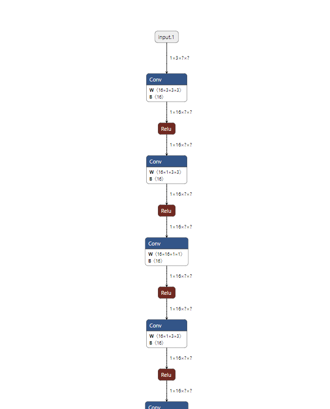
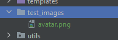
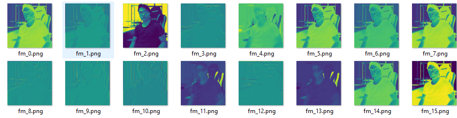

# ONNX - Feature Maps Visualizer

# Introduction

Edit ONNX Model  
Visualize ONNX Model  
Visualize Feature Maps ONNX Model

`onnx-fm-visualizer` is built based on [onnx-modifier](https://github.com/ZhangGe6/onnx-modifier)


Currently, the following editing operations are supported:

:white_check_mark: Delete/recover nodes<br>
:white_check_mark: Rename the node inputs/outputs<br>
:white_check_mark: Rename the model inputs/outputs<br>
:white_check_mark: Add new model outputs<br>
:white_check_mark: Edit the attribute of nodes<br>
:white_check_mark: Add new nodes<br>
:white_check_mark: Change batch size<br>
:white_check_mark: Edit model initializers<br>
:white_check_mark: View Feature Maps when click Node<br>


## Getting started

Clone the repo and install the required Python packages by

```bash
git clone git@github.com:ZhangGe6/onnx-modifier.git
cd onnx-fm-visualizer
pip install onnx flask numpy opencv-python
```

Then run

```bash
python app.py
```

Click the url in the output info generated by flask (defaults to `http://127.0.0.1:5000/`), then `onnx-modifier` will be launched in the web browser.

## Visualizer
### Load model and graph shown:  

  

### Put some images to 'test_images'  

  

### Click at 'Conv' Node you want to get Feature Maps and Check at ```results```
```results/<name image>_<name node clicked>```

  
